# Ponto de venda - genérico

Este projeto tem como intuito por em pratica tudo o q foi aprendido durnate o curso de formação backend na Cubos, porém trazendo para a aplicação mais proxima do real.

Este README tem como funcção detlahar o uso da API, descrevendo as respostas possiveis geradas por seus endpoints.

### Informações gerais:

- Versão: 1.0,
- Descrição: API ára gerenciamento de um ponto de venda,
- Titulo: PDV
- Instalação das bibliotecas necessárias a execução da API: [ npm install -i ]

## Endpoints:

## **Cadastrar usuario**

**Rota**: 'POST/user'

**Descrição**: Endpoint para cadastro de novos usuarios.

**Entrada**: Requisição body json:

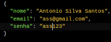

**Respostas**:

- Status: 201 - Cadastro realizado com sucesso

  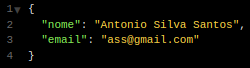

- Status: 400 - Bad request: Esse estatus é emitido sempre que uma das varivais de entrada não for condizendo com as regras definidas pela API:

        - Nome: vazio, tendo menos que 4 caracteres, carcateres diferentes de letras;
        - Email: vazio, tendo menos que 4 caracteres, carcateres diferentes de letras, email já cadastrado;
        - Senha: vazio, tendo menos que 4 caracteres.

## **Login**

**Rota**: 'POST/login'

**Descrição**: Endpoint para login do usuário já cadastrado.

**Entrada**: Requisição body json:

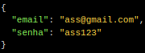

**Respostas**:

- Status: 201 - Login realizado com sucesso, temos como resposta as informações realcionadas ao usuaria logado e o Bearer Token que permite acesso aos demais endpoints a partir de agora.

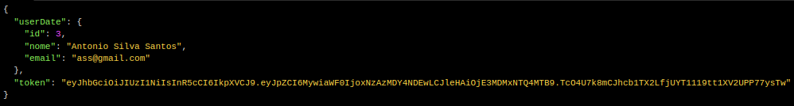

- Status: 400 - Bad request: Esse estatus é emitido sempre que uma das varivais de entrada não for condizendo com as regras definidas pela API:

        - Email: vazio, tendo menos que 4 caracteres, carcateres diferentes de letras;
        - Senha: vazio, tendo menos que 4 caracteres.

- Status: 401 - Unauthorized: Status emitido caso o email não seja o correto para o usuario

## **Detalhar usuario logado**

**Rota**: 'GET/user'

**Descrição**: Endpoint que retorna o nome e o email do usuario logado, função necessário apos a atualização de dados do mesmo usuario, para confirmar a alteração desses dados.

**Entrada**: Não requer

**Respostas**:

- Status: 200

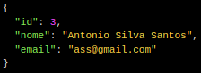

## **Atualizar dados do usuario**

**Rota**: 'PUT/user'

**Descrição**: Endpoint para atualização de dados relacionados com o usuario logado

**Entrada**: Requisição Body Json:

**Respostas**:

- Status: 204 - No Content: Requisição realizada com sucesso, porém não há nada a ser retornado.

- Status: 400 - Bad request: Esse estatus é emitido sempre que uma das varivais de entrada não for condizendo com as regras definidas pela API:

        - Email: vazio, tendo menos que 4 caracteres, carcateres diferentes de letras;
        - Senha: vazio, tendo menos que 4 caracteres.

- Status: 401 - Unauthorized: Status emitido caso o email já esteja cadastrado no banco de dados, realacionado a outro usuario.

## **Deletar usuario**

**Rota**: 'DELETE/user'

**Descrição**: Endpoint para deletar usuarios

**Entrada**: ID do usuario a ser deletado como query:

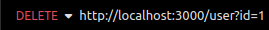

**Respostas**:

- Status: 204 - No Content: Requisição realizada com sucesso, porém não há nada a ser retornado.

- Status: 404 - No Found: Id do usuario não encontrado

## Registrar novo produto

**Rota**: 'POST/produto'

**Descrição**: Endpoint registro de produtos no sistema, caso o produto registrado já exista na base de dados, a quantidade do produto existente e o valor seram atualizdos para as novas informações

**Entrada**: Requisição com body Json

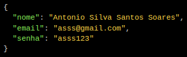

**Respostas**:

- Status: 201 - Created: Registro criado com sucesso

  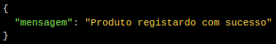

- Status: 400 - Bad request: Esse estatus é emitido sempre que uma das varivais de entrada não for condizendo com as regras definidas pela API:

  - Descrição: vazia, minimo de 4 caracteres, não composta somente por letras;
  - Quantidade em estoque: vazia, não sendo composta somente por numeros;
  - Valor: vazia, não sendo composta somente por numeros;
  - Categoria_id: vazia, não sendo composta somente por numeros, categoria inexistente.

## Listar produtos

**Rota**: 'GET/produto'

**Descrição**: Endpoint onde podemos ter todos os produtos resgitrados na base de dados, sendo que, caso seja passado o parametro query "categoria_id" a filtrage será realizada somente para produtos dessa natureza, caso não, teremos todos os produtos registrados.

**Entrada**:

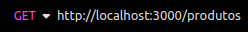

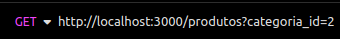

**Respostas**:

- Status: 200: Retorna todos os produtos na base

  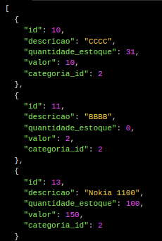

- Status: 404 - Not Found: Quando não existem produtos referentes a categoria_id

## **Atualizar Produtos**

**Rota**: 'PUT/produto/:id'

**Descrição**: Endpoint para atualização dos dados de um produto, caso um produto ao ser realizado passe a ter a mesma descrição de um produto ja presente na base, as informações de wuantidade em estoque evalor, seram atualizados no produto de menor ID.

**Entrada**: Requisição body Json:

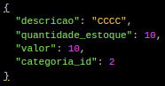

**Respostas**:

- Status: 204: No Content: Produto atualizado com sucesso, nada a retornar.

- Status: 400 - Bad Request: Quando as variaveis de entrada não passam pela validação, motivos:

  - Descrição: vazia, minimo de 4 caracteres, não composta somente por letras;
  - Quantidade em estoque: vazia, não sendo composta somente por numeros;
  - Valor: vazia, não sendo composta somente por numeros;
  - Categoria_id: vazia, não sendo composta somente por numeros, categoria inexistente.

## **Detalhar Produto**

**Rota**: 'GET/produto/:id'

**Descrição**: Endpoint para retornar os dados de somente um unico produto presente na base de dados.

**Entrada**: [ http://localhost:3000/produto/:id ]

**Respostas**:

- Status: 200: Retorna o produto realacionado ao ID

  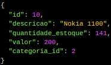

- Status: 404 - Not Found: Quando não existem produtos referentes ao ID.

## **Deletar produto**

**Rota**: 'DELETE/produto/:id'

**Descrição**: Endpoint para deleter um determinado produto da base de dado, sendo que não é possível deletar produtos que estejam vinculados a pedidos realizados.

**Entrada**: [ http://localhost:3000/produto/:id ]

**Respostas**:

- Status: 204: Not Content: Produto deletado com sucesso, nada a retornar ao usuario.

- Status: 400 - Bad Resquest: Quando a entrada não é válida:

  - Id: Vazio, não sendo um numero real, inteiro e positivo.

- Status: 404 - Not Found: Quando não existem produtos referentes ao ID.

## **Registrar pedido**

**Rota**: 'POST/pedido'

**Descrição**: Rota para registro dos pedidos.

**Entrada**:

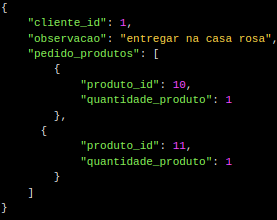

**Respostas**

- Status: 201: Created: Pedido resgitrado com sucesso.

- Status: 404: Not Found: Cliente não encontrado.

## **Listar Pedidos**

**Rota**: 'GET/pedido'

**Descrição**: Endpoint que retorna os pedidos presentes na base, podendo ou não, receber uma ID como parametro de pesquisa. Ao receber um ID sera feita uma filtragem por ID do cliente.

**Entrada**: [ http://localhost:3000/pedidos ]

             [ http://localhost:3000/pedidos?id=11 ]

**Respostas**:

- Status: 200:

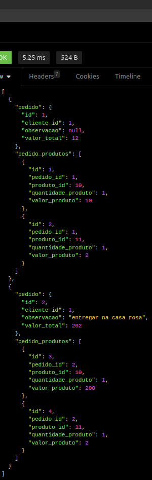
